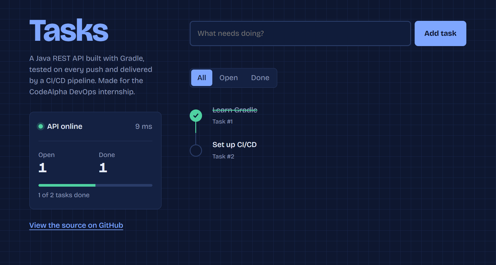
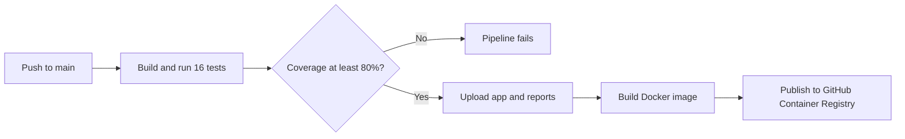

# Task Manager

[](https://github.com/rayyanmajid344-creator/CodeAlpha_JavaGradleApp/actions/workflows/ci.yml)

A task manager web app with a Java REST API, built with Gradle and delivered by a CI/CD pipeline that tests every change, enforces code coverage, and publishes a Docker image.

Built for the **CodeAlpha DevOps Internship** (Task 3: Java Application using Gradle).



## Features

- **Web interface** with a pipeline-style task list, filters, and a live status panel that monitors API health and response time
- **REST API** with full create, read, update, and delete support
- **Input validation** with clear 400 and 404 error responses
- **16 automated tests**: unit tests for the business logic and API tests over real HTTP
- **80% coverage gate**: the build fails if test coverage drops
- **Multi-stage Docker image** that runs as a non-root user with a built-in health check

## Tech stack

| Area | Tools |
|---|---|
| Language | Java 25 |
| Build and dependencies | Gradle with a version catalog (`gradle/libs.versions.toml`) |
| Web framework | Javalin |
| Testing | JUnit 5, Javalin test tools, JaCoCo coverage |
| CI/CD | GitHub Actions |
| Containers | Docker, GitHub Container Registry |

## CI/CD pipeline

Every push to `main` runs this pipeline:



Each run also posts a coverage table on its summary page and keeps the packaged app, test report, and coverage report as downloadable artifacts. The Docker image is only published when every test passes, and each image is tagged with its commit so any version can be traced back to the code that produced it.

## Run it

**With Docker** (no Java needed):

```
docker run -p 7070:7070 ghcr.io/rayyanmajid344-creator/codealpha_javagradleapp:latest
```

**With Gradle** (needs Java 25):

```
./gradlew run
```

Then open http://localhost:7070

## API

| Method | Endpoint | Description | Success |
|---|---|---|---|
| `GET` | `/api/tasks` | List all tasks | 200 |
| `POST` | `/api/tasks` | Create a task: `{"title": "..."}` | 201 |
| `PATCH` | `/api/tasks/{id}` | Mark done or not done: `{"done": true}` | 200 |
| `DELETE` | `/api/tasks/{id}` | Delete a task | 204 |
| `GET` | `/health` | Health check | 200 |

Invalid input returns `400`, and unknown task IDs return `404`, both with a JSON error message.

## Tests and coverage

```
./gradlew build
```

This compiles the app, runs all tests, and checks the coverage gate. The coverage report is written to `app/build/reports/jacoco/test/html/index.html`.

## Project structure

```
app/
├── src/main/java/com/codealpha/app/
│   ├── App.java            API routes and server setup
│   ├── TaskService.java    Business logic and validation
│   └── Task.java           Task data model
├── src/main/resources/public/
│   └── index.html          Web interface
├── src/test/java/com/codealpha/app/
│   ├── AppTest.java        Unit tests
│   └── ApiTest.java        API tests over HTTP
└── build.gradle            Build, dependencies, coverage rules
gradle/libs.versions.toml   Dependency versions in one place
Dockerfile                  Multi-stage container build
.github/workflows/ci.yml    CI/CD pipeline
```